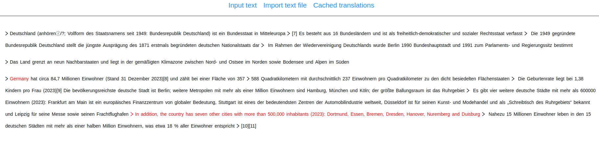

## German reading excercise app

This is the FE for an app that can help you practice German. 
You can paste a text and get a translation for each single word (by clicking on it) or for the whole sentence (by clicking the **>** icon).
The app allows you to import a text file for doing the same.

The sentence translations are cached on your local browser, so you can read in the Metro in peace, without worrying about the internet connection :D.

For longer texts, a pagination mechanism is implemented ;-)

## Link to the app

You can try the app [here](https://domenicosacco94.github.io/linguistic-repo). Use **input** to enter the text in German.

## Main tools used

- **React** with **Typescript**
- **Antd** for the styling
- **Zustand** for a simple state management
- **create-react-app** to spin up the react application
